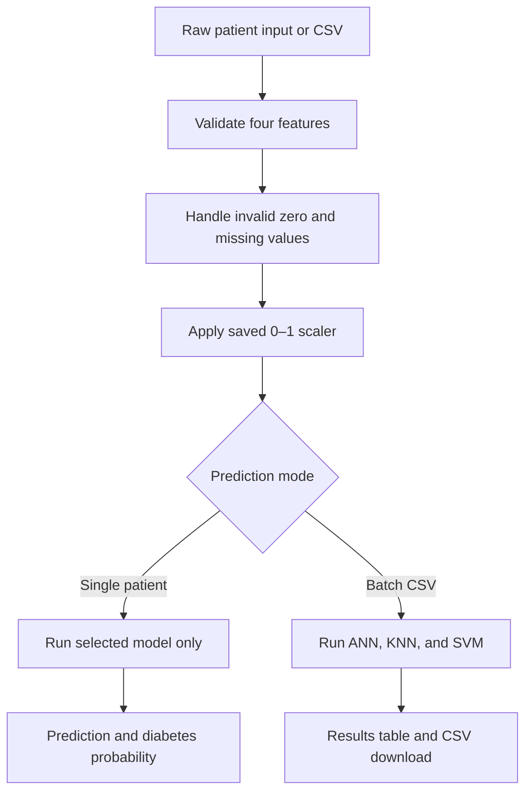

# Diabetes Prediction System

A Streamlit-based machine-learning prototype that estimates diabetes risk from
four raw clinical inputs and supports three independently trained classifiers:
Artificial Neural Network (ANN), K-Nearest Neighbours (KNN), and Support Vector
Machine (SVM).

The application accepts normal medical values. Missing-value handling and
0–1 normalisation are performed automatically before prediction.

> **Educational-use notice:** This project is an academic prototype. Its output
> must not be used as a medical diagnosis or as a replacement for advice from a
> qualified healthcare professional.

## Key features

- Single-patient diabetes prediction using a user-selected ANN, KNN, or SVM.
- Only the selected model is executed and displayed for a single prediction.
- Consistent display of the **diabetes probability** for all three models.
- Batch CSV upload for predicting multiple patients.
- ANN, KNN, and SVM predictions and probabilities for every valid CSV row.
- Downloadable batch-prediction results.
- Model comparison using accuracy, precision, recall, F1-score, and ROC-AUC.
- Prediction-history viewing, filtering, downloading, and clearing.
- Input schema, numeric-type, range, and missing-value validation.
- Shared training and prediction preprocessing through saved imputer/scaler
  artifacts.
- Model-specific metrics, test predictions, feature ablation, ROC-curve pages,
  and permutation feature-importance analysis.
- Separate ANN, KNN, and SVM training files for individual team ownership.

## System flow



## Input features

The current production models expect the following feature order:

| Position | Feature | Description | Frontend range |
|---:|---|---|---:|
| 1 | `Pregnancies` | Number of pregnancies | 0–20 |
| 2 | `Glucose` | Plasma glucose concentration (mg/dL) | 0–300 |
| 3 | `BMI` | Body mass index (kg/m²) | 0–70 |
| 4 | `Age` | Age in years | 1–120 |

`Outcome` is the training target:

- `0` = non-diabetic
- `1` = diabetic

The source Pima dataset contains eight predictors, but this version uses four
selected features. Every saved model, the imputer, the scaler, the frontend,
and uploaded CSV files must use the same four-feature order.

## Dataset summary

The working `Data/diabetes.csv` contains 2,000 rows:

| Property | Value |
|---|---:|
| Total rows | 2,000 |
| Non-diabetic (`Outcome = 0`) | 1,298 (64.9%) |
| Diabetic (`Outcome = 1`) | 702 (35.1%) |
| Unique complete rows | 1,768 |
| Exact duplicate rows | 232 |
| Training rows | 1,600 |
| Held-out test rows | 400 |

The split is stratified with `RANDOM_STATE = 42`, so all three model scripts use
the same training and test records.

### Dataset limitation

The 2,000-row project CSV is an expanded version of the original 768-record
Pima Indians Diabetes dataset and contains 232 exact duplicates. A random split
can place matching records in both training and testing sets, making measured
performance optimistic. The scores in this README describe this project
dataset and are **not external clinical-validation results**.

## Preprocessing

The shared preprocessing sequence is:

1. Enforce `Pregnancies`, `Glucose`, `BMI`, and `Age` in the required order.
2. Convert values to numeric types and reject invalid input.
3. Convert physiologically invalid `Glucose = 0` and `BMI = 0` to missing
   values. `Pregnancies = 0` remains valid.
4. Replace missing values with medians learned from training data only.
5. Transform all four inputs to the range 0–1 using `MinMaxScaler` fitted on
   training data only.
6. Save and reuse `models/imputer.pkl` and `models/scaler.pkl` for the
   application and all three models.

Users should enter **raw medical values**, not manually normalised values.

## Verified model performance

The following results were generated from the same 400-row held-out test split:

| Model | Accuracy | Precision | Recall | F1-score | ROC-AUC |
|---|---:|---:|---:|---:|---:|
| ANN | 0.8475 | 0.7762 | 0.7929 | 0.7845 | 0.9096 |
| KNN | **0.8650** | **0.8162** | 0.7929 | **0.8043** | **0.9239** |
| SVM | 0.8475 | 0.8015 | 0.7500 | 0.7749 | 0.9104 |

KNN currently has the highest test accuracy. Accuracy alone should not be used
to assess a medical classifier; recall is also important because it indicates
the proportion of diabetic cases detected by the model.

### Selected configurations

| Model | Final configuration |
|---|---|
| ANN | ReLU MLP `(64, 32)`, Adam, `alpha=0.01`, learning rate `0.01`, five-model soft-voting ensemble |
| KNN | `n_neighbors=6`, distance weighting, weighted Minkowski distance, `p=2` |
| SVM | RBF kernel, `C=30`, `gamma=100`, sigmoid probability calibration using training folds |

## Project structure

```text
AI/
├── Diabates Prediction.py          # Main Streamlit application
├── requirements.txt
├── CSS/
│   └── styles.py                   # Streamlit styling
├── Data/
│   ├── diabetes.csv
│   ├── ann_metrics.csv
│   ├── knn_metrics.csv
│   ├── svm_metrics.csv
│   ├── ann_ablation.csv
│   ├── knn_ablation.csv
│   ├── svm_ablation.csv
│   ├── ann_test_predictions.csv
│   ├── knn_test_predictions.csv
│   ├── svm_test_predictions.csv
│   └── team_feature_importance.png
├── models/
│   ├── imputer.pkl
│   ├── scaler.pkl
│   ├── ann_model.pkl
│   ├── knn_model.pkl
│   └── svm_model.pkl
└── scripts/
    ├── __init__.py
    ├── preprocessing.py
    ├── model_transformers.py
    ├── Ann_Model.py
    ├── Knn_Model.py
    ├── Svm_Model.py
    ├── roc_curve_ann.py
    ├── roc_curve_knn.py
    ├── roc_curve_svm.py
    ├── confusion_matrix_svm.py
    ├── confusion_matrix_ann.py
    ├── confusion_matrix_knn.py
    └── team_feature_importance.py
```

## Installation

Python 3.11–3.14 can be used when all dependencies provide compatible wheels.
Use one Python environment for training and Streamlit so the saved scikit-learn
artifacts remain compatible.

From the project root in Windows Command Prompt:

```bat
cd /d C:\Users\JooYee\Downloads\AI-Assignment
py -m pip install --upgrade pip
py -m pip install -r requirements.txt
```

Run the scripts from the project root in this order:

```bat
py scripts\Ann_Model.py
py scripts\Knn_Model.py
py scripts\Svm_Model.py
```

`Ann_Model.py` runs first because it fits and saves the shared `imputer.pkl`
and `scaler.pkl`. KNN and SVM train independently but reuse those artifacts to
ensure identical preprocessing.

Each script:

- Loads and validates the same dataset.
- Uses the same stratified train/test split.
- Tunes only its own algorithm using training cross-validation.
- Evaluates once on the common test set.
- Saves only its own final model and reports.
- Performs leave-one-feature-out evaluation by retraining that model with the
  remaining features.

## Run the application

```bat
cd /d C:\Users\JooYee\Downloads\AI-Assignment
py -m streamlit run "Diabates Prediction.py"
```

Open the local URL displayed in Command Prompt, normally:

```text
http://localhost:8501
```

Press `Ctrl+C` in Command Prompt to stop Streamlit.

## Batch CSV prediction

The uploaded CSV must contain these exact feature names:

```csv
Pregnancies,Glucose,BMI,Age
3,162,30.0,35
1,85,26.6,31
6,148,33.6,50
```

The application performs the following operations:

1. Reads the uploaded CSV.
2. Confirms that all four required columns exist.
3. Rejects non-numeric and out-of-range values.
4. Handles missing values with the saved imputer.
5. Applies the saved 0–1 scaler.
6. Runs ANN, KNN, and SVM for every valid patient.
7. Displays predictions and diabetes probabilities.
8. Provides a downloadable result CSV.

## Analysis pages and scripts

### ROC curves

Run the relevant model script first so its test-prediction CSV is current, then
launch its ROC page:

```bat
py -m streamlit run scripts\roc_curve_ann.py
py -m streamlit run scripts\roc_curve_knn.py
py -m streamlit run scripts\roc_curve_svm.py
```

Do not run a Streamlit page using only `py scripts\...`; doing so produces
`missing ScriptRunContext` warnings.

### SVM confusion matrix

```bat
py -m streamlit run scripts\confusion_matrix_svm.py
py -m streamlit run scripts\confusion_matrix_ann.py
py -m streamlit run scripts\confusion_matrix_knn.py
```

Run `py scripts\Svm_Model.py` first if
`Data\svm_test_predictions.csv` does not exist.

### Team feature importance

```bat
py scripts\team_feature_importance.py
```

This script calculates model-agnostic permutation importance and saves:

```text
Data\team_feature_importance.png
```

The verified importance ranking for the current four features is:

1. Glucose
2. Age
3. BMI
4. Pregnancies

## Saved artifacts

| Artifact | Purpose |
|---|---|
| `imputer.pkl` | Applies training-set median values to missing inputs |
| `scaler.pkl` | Converts raw medical measurements to the trained 0–1 scale |
| `ann_model.pkl` | Saved ANN ensemble |
| `knn_model.pkl` | Saved tuned KNN classifier |
| `svm_model.pkl` | Saved tuned and probability-calibrated SVM |

All five artifacts must be deployed together. Mixing models and preprocessing
files from different training runs can produce incorrect predictions or
feature-count errors.

## Common troubleshooting

### `FileNotFoundError: diabetes.csv`

Run commands from the project root and ensure the file exists at:

```text
Data\diabetes.csv
```

### `FileNotFoundError: imputer.pkl` or `scaler.pkl`

Run ANN first:

```bat
py scripts\Ann_Model.py
```

The files must be located inside `models`, not the project root.

### `X has 4 features, but ... is expecting 8`

The model and preprocessing artifacts came from different project versions.
Retrain all three models with the current four-feature scripts and deploy the
new `imputer.pkl`, `scaler.pkl`, and three model files together.

### `missing ScriptRunContext`

The file is a Streamlit page and was started using normal Python. Use:

```bat
py -m streamlit run scripts\FILE_NAME.py
```

### Streamlit website shows old metrics

Commit and push the updated files below, then reboot the deployed application:

```text
models/*.pkl
Data/*_metrics.csv
Data/*_test_predictions.csv
scripts/*.py
Diabates Prediction.py
requirements.txt
```

## Reproducibility and responsible use

- `RANDOM_STATE = 42` is used for reproducible data splitting and tuning.
- Imputation and scaling are fitted on training data only.
- Hyperparameters are selected through stratified training cross-validation.
- The held-out test set is not used for model fitting or parameter selection.
- Metrics are calculated from actual predictions rather than hard-coded values.
- No prediction should be interpreted as a confirmed diagnosis.
- The duplicate-row limitation must be disclosed when presenting the reported
  accuracy.

## Main technologies

-nltk
-joblib
-streamlit
-scikit-learn
-pandas
-numpy
-tabulate
-seaborn

